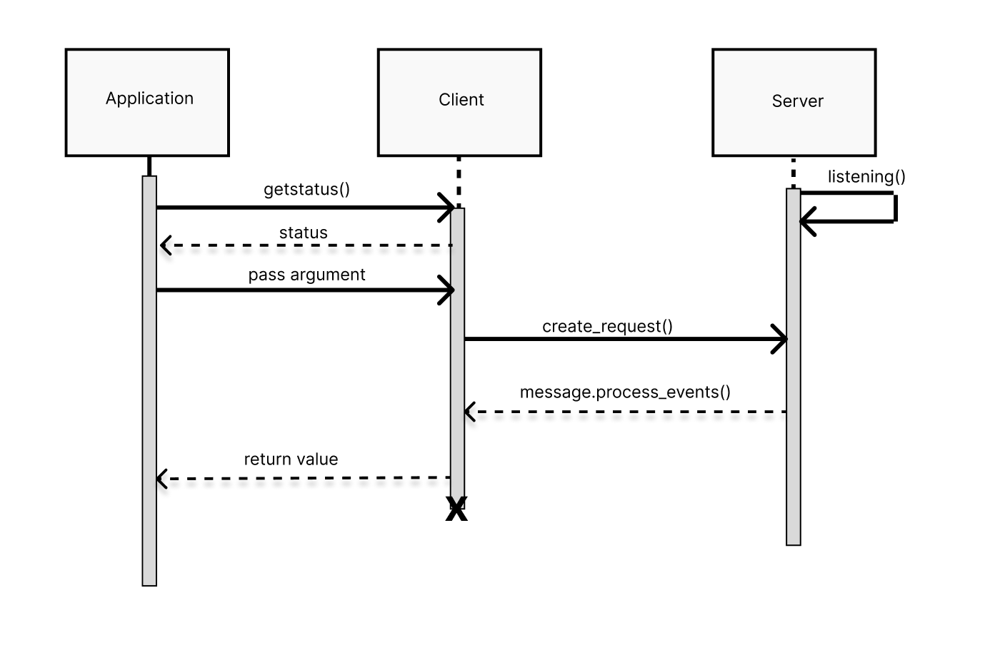

# Lists Generator

Receives as input an integer argument *n*.

Returns a *n* by *n* list of list that are diagonally dominant for use in a
Gauss Seidel Method application. Additionally, returns a final list of *n*
length.

Clone the repository or copy files into your applicaiton directory.

## Start server and listen
Start the server with the command:
`[$]python app-server.py <host> <port>`

e.g.,: `python3 app-server 127.0.0.1 65432`

The server will then display the following message:
`Listening on ('127.0.1.1', 65432)`

## Send request via client
Start the client via the command line or appropriate application with arguments
as follows:
`[$]python app-client.py <host> <port> <action> <value>`

where `<action>` is "search" and `<value>` is the integer argument corresponding
to the value of *n* you want to use for your lists.

## Recieving returned data
Data will be returned to the client in JSON format via the 'result' variable. 

## UML Diagram

